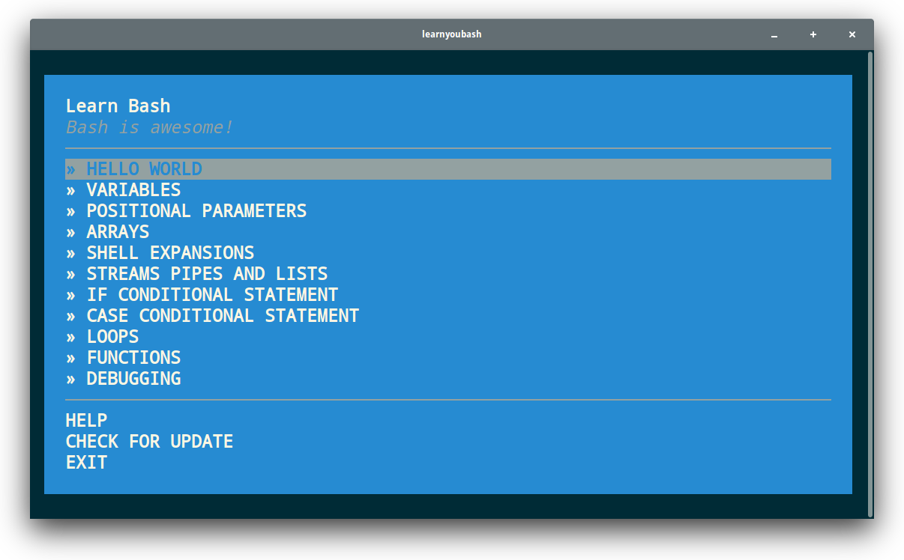

# learnyoubash

[![NPM version][npm-image]][npm-url]
[![node][node-image]][node-url]
[![Build Status][travis-image]][travis-url]
[![Dependency Status][depstat-image]][depstat-url]

> Learn you how to use the terminal and write your the first Bash script.

This workshopper is based on **bash-handbook**, so if you want to more examples, [check it out](https://git.io/bash-handbook).

## Requirements

This workshopper requires **Bash** environment. Use [Cygwin](cygwin) if you are Windows user. Also if you are on Windows, make sure you are using at least 5.1.0 version of Node.js, which provides a fix for a bug on Windows where you can't choose items in the menu.

* [**Node.js**](node-url) >=6.0.0
* **Bash** (use [Cygwin][cygwin] if you are on Windows)

## Installation

Open your terminal and run this command:

    npm install -g learnyoubash

Use `sudo` if you get an `EACCESS` error.

## Usage

Open your terminal and run the following command:

    learnyoubash

## License

MIT © [Denys Dovhan](http://denysdovhan.com)

<!-- References -->

[cygwin]: https://www.cygwin.com/

[npm-url]: https://npmjs.org/package/learnyoubash
[npm-image]: https://img.shields.io/npm/v/learnyoubash.svg?style=flat-square

[node-url]: https://nodejs.org/en/download/
[node-image]: https://img.shields.io/node/v/learnyoubash.svg?style=flat-square

[travis-url]: https://travis-ci.org/denysdovhan/learnyoubash
[travis-image]: https://img.shields.io/travis/denysdovhan/learnyoubash.svg?style=flat-square

[depstat-url]: https://david-dm.org/denysdovhan/learnyoubash
[depstat-image]: https://david-dm.org/denysdovhan/learnyoubash.svg?style=flat-square
